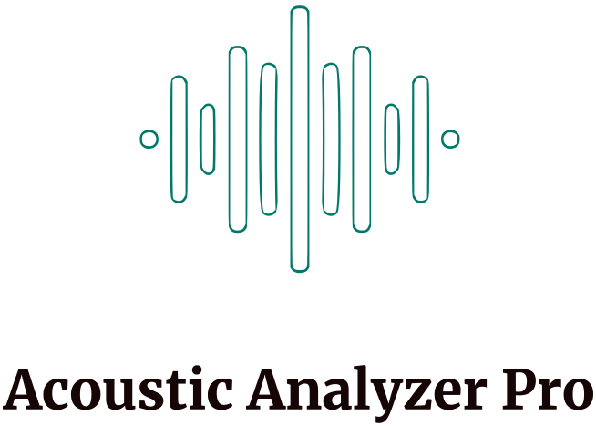
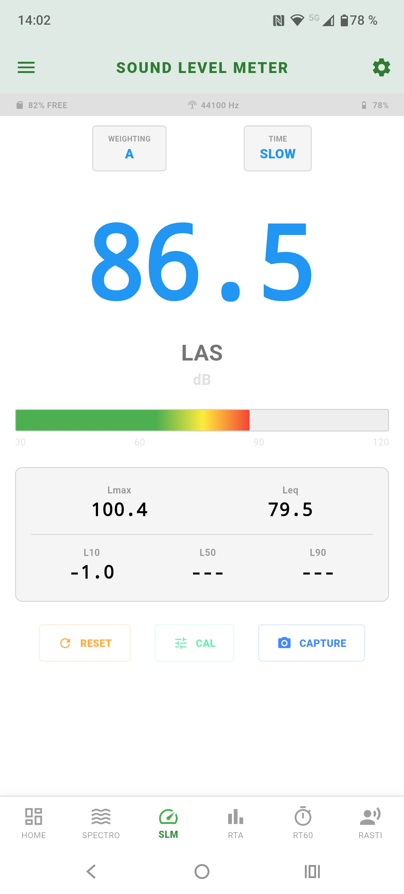
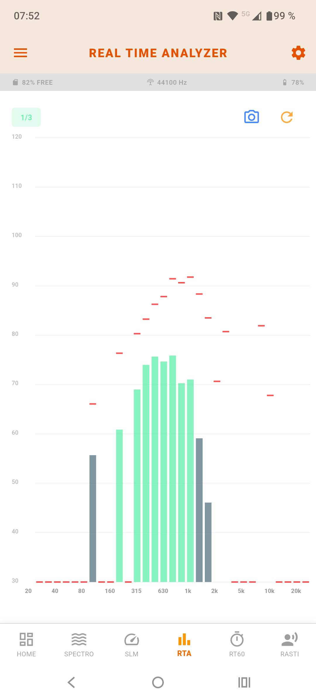
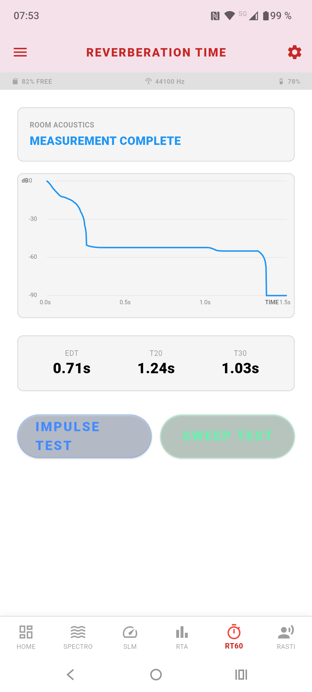

# Acoustic Analyzer Pro
<p align="center" width="100%">
  
</p>

Solarized dark             |  Solarized Ocean             |  Solarized Ocean
:-------------------------:|:-------------------------:|:-------------------------:
  |     |  

### Content
The app generates a professional acoustic analyzer. It was generated with Gemini Flash 3.
As audio backend MiniAudio is used. Dart source files are located in: [Apps/Source/acoustic-analyzer/example/lib](Apps/Source/acoustic-analyzer/example/lib)

### Installation
You can install and run the app in Android Studio after importing the gradle project as following:

```python
Windows
flutter.bat --no-color run --machine --track-widget-creation --device-id=chrome --start-paused --android-skip-build-dependency-validation --dart-define=flutter.inspector.structuredErrors=true --devtools-server-address=http://127.0.0.1:9100 lib\main.dart

Android
flutter.bat --no-color run --machine --track-widget-creation --device-id=device-id --start-paused --android-skip-build-dependency-validation --dart-define=flutter.inspector.structuredErrors=true --devtools-server-address=http://127.0.0.1:9100 lib\main.dart

```

### Author
Felix Pfreundtner
